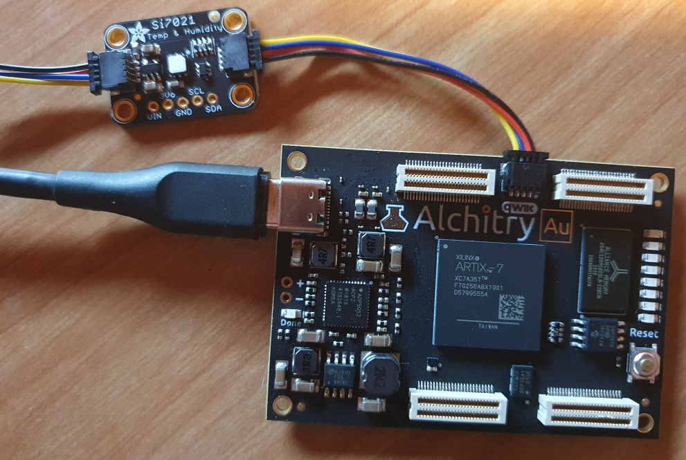
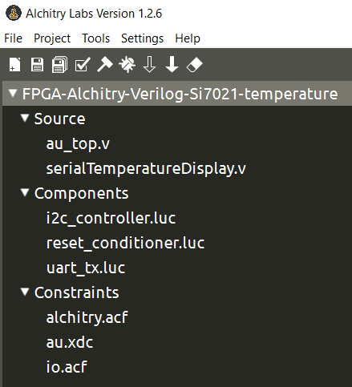
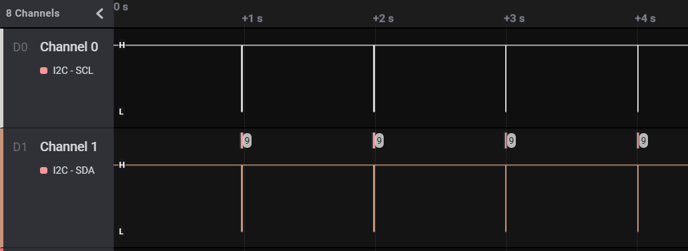
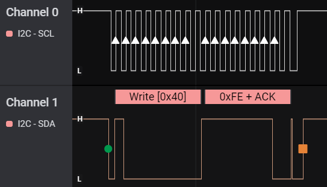
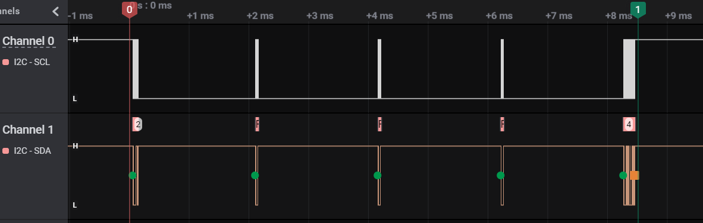
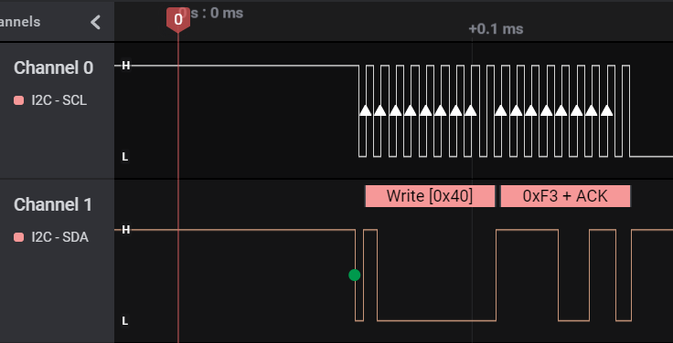
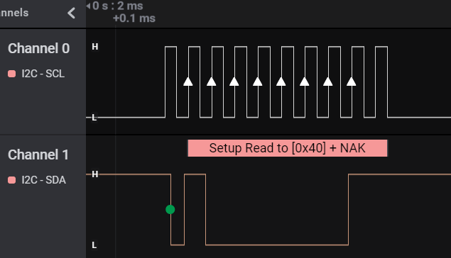
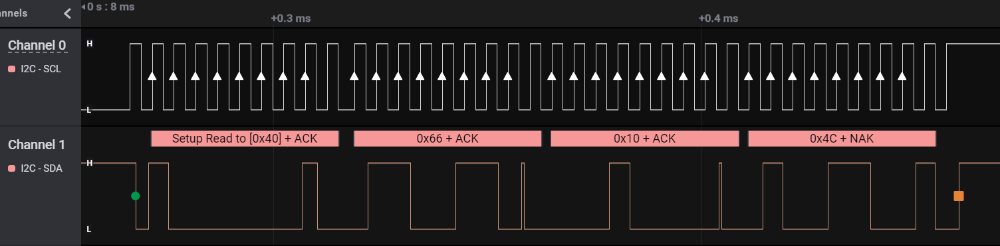
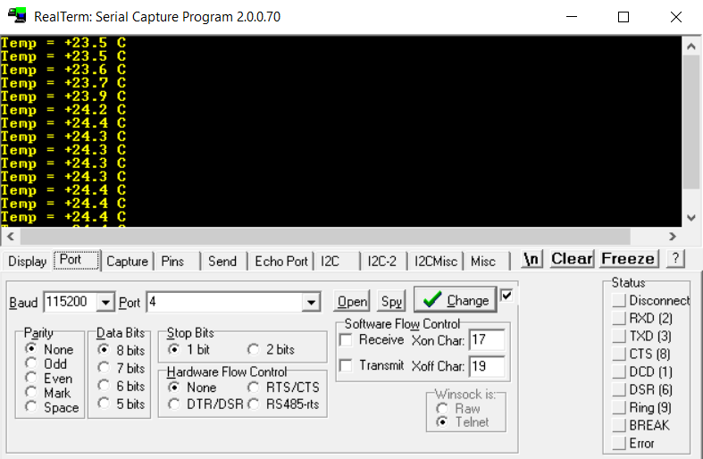

# FPGA-Alchitry-temperature sensor si7021

## Verilog driver for the si7021 temperature sensor

### Matériels

 - carte FPGA [Alchitry Au](https://alchitry.com/products/alchitry-au-fpga-development-board) ;
 - module [Adafruit Si7021](https://www.adafruit.com/product/3251) (système [Qwiic Connect](https://www.sparkfun.com/qwiic) de Sparkfun) ;
 - [câbles Qwiic](https://www.sparkfun.com/categories/tags/qwiic-cables) de Sparkfun ;
 - facultatif : pour visualiser les trames I2C, analyseur logique compatible *Saleae* à bas coût (24 MHz, 8 canaux).
 
### Configuration EDI Alchitry Labs
 
 - [EDI Alchitry Labs v1.2.6](https://alchitry.com/pages/alchitry-labs) ;
  

 - rajouter les composants *UART TX* (affichage des résultats dans un terminal série) et *I2C Controller* (communication I2C avec Si7021) ;
 - rajouter le fichier des contraintes *io.acf* pour la localisation des broches SDA et SCL (voir dans le dossier *constraint*).
 
 ## Fonctionnement du système et analyse des trames I2C
 
 - une acquisition de température est effectuée chaque seconde :

 
 - au démarrage de la carte, ou après appui sur le bouton *reset* de la carte, la commande *reset* (0xFE) est envoyée :

- l'acquisition de température prend 8 ms (entre les repères 0 et 1) :

 
 - une acquisition de température débute avec l'envoi de la commande 0xF3 (*Measure Temperature, No Hold Master Mode*) :

- toutes les 2 ms, on regarde si la conversion est terminée. Tant que la donnée de température n'est pas disponible, le module Si7021 refuse d'acquitter (*NAK*) :

- 8 ms après le début de l'acquisition, le module Si7021 acquitte enfin (*ACK*). Il reste à récupérer les trois octets de données :

| poids fort MSB | poids faible LSB | ChkSum |

Ici, MSB=0x66 et LSB=0x10. D'après la formule de la *datasheet*, il fait 23,2 °C.

- La température peut être affichée directement en °C dans un terminal série (115 200 bauds, 8N1), ici *RealTerm* :

